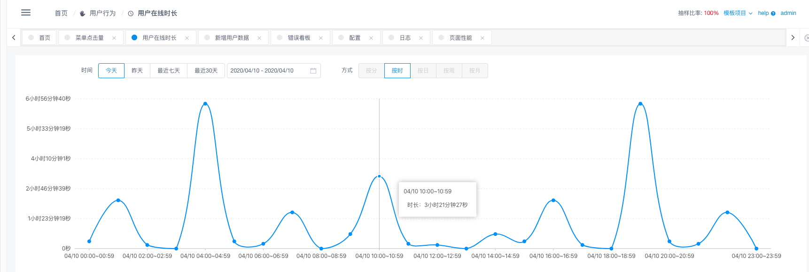
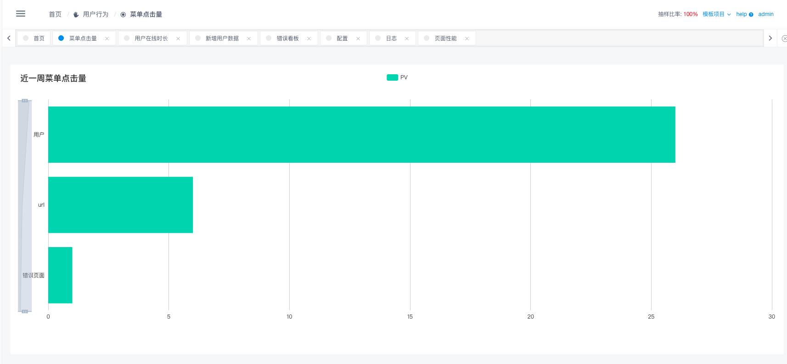
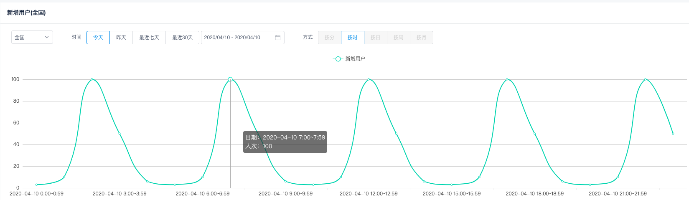
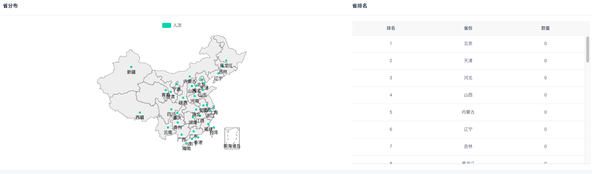
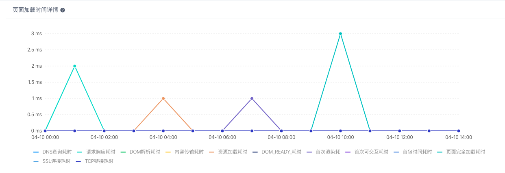
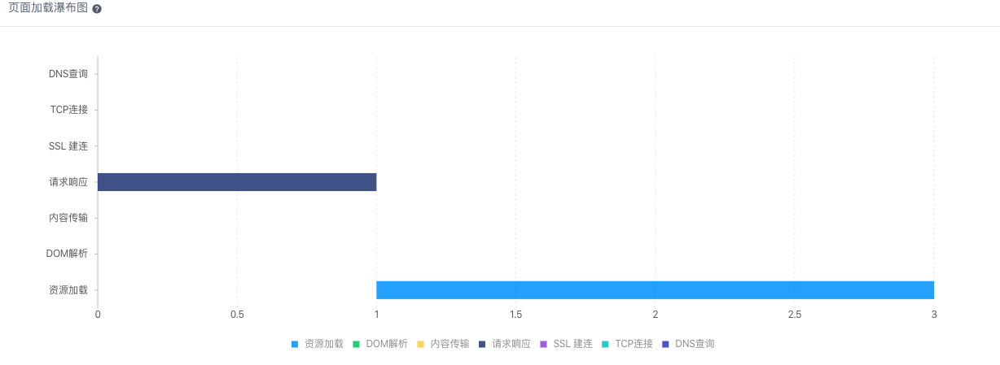
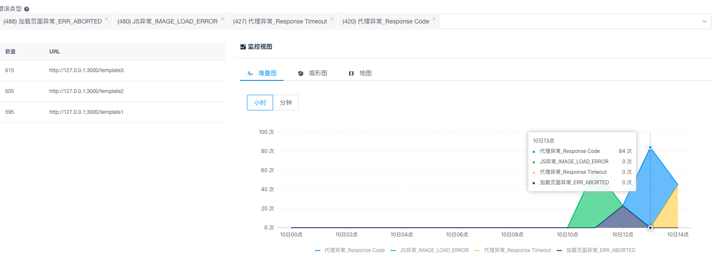
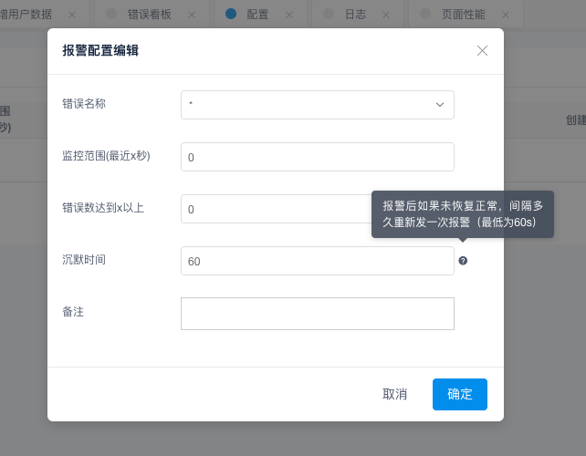
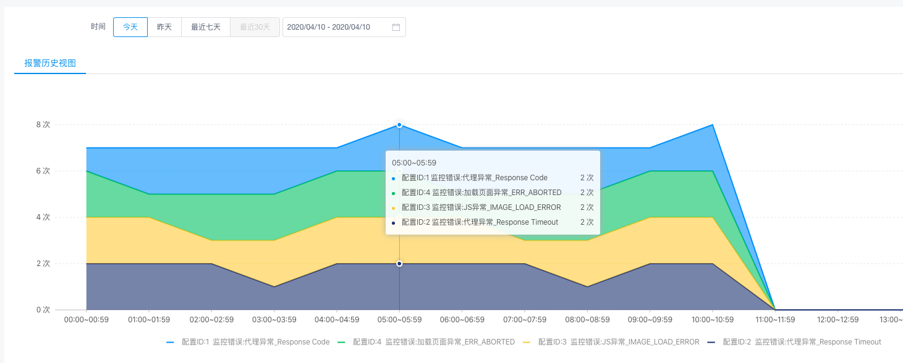

# 灯塔

## 介绍
**fee（灯塔）** 是前端监控系统，贝壳找房主要前端监控系统，服务公司上百条产品线。
特点：**架构简单、轻量、支持私有化部署**。可收集前端**设备、系统、环境**信息，
可以对前端**页面js报错、资源错误、性能指标**进行配置报警等，
并且可以通过上报错误信息引导用户快速定位解决问题。

## 系统功能

### 用户行为

- 用户在线时长



- 菜单点击量



- 用户增长




### 异常监控

- 页面性能




- 错误看板



### 报警

- 报警配置



- 报警日志



## 环境搭建

**下述`mysql`以及`redis`环境的搭建，大家可以移步配套 [Docker集成环境一键部署](https://github.com/alphawq/Fee-dev-docker)（欢迎大家`star`）。可以帮助大家一键创建相关服务环境，免去繁琐的环境部署与配置给大家带来的不必要的时间开销！**
1. [mysql](https://www.mysql.com/)
2. [Node.js](http://nodejs.cn/)
3. [redis](https://redis.io/)
4. 克隆项目 在克隆项目之前确保你的`nodejs`、`mysql`和`redis`环境是可用的。
   ```bash
    mkdir -p ~/www/ \
    &&  cd ~/www/ \
    &&  git clone git@github.com:LianjiaTech/fee.git \
    &&  cd fee
    ```
    在`~/www/openfee`找到我们克隆的项目
    
5. 配置MySQL
- 在`server/src/configs/mysql.js`中修改主机地址/数据库端口/数据库用户名/数据库密码/数据库库名
- 在数据库中创建一个空的名字叫做『`platform`』的数据库。
    ```javascript
    const development = {
      host: '127.0.0.1', // 主机地址
      port: '3306', // 数据库端口
      user: 'root', // 数据库用户名
      password: '00000000', // 数据库密码
      database: 'platform'  // 数据库库名
    }
    ```
6. 配置`redis`
- 在`server/src/configs/redis.js`中修改主机地址或`redis`端口
    ```javascript
    // 开发环境配置
    const development = {
      host: '127.0.0.1', // 主机地址
      port: '6379' // redis端口
    }
    ```
7. 安装依赖，在项目 `server` 目录下
    ```javascript
    npm install
    ```
8. 编译 `server`，打开一个新的**窗口**在项目 `server` 目录下
    ```javascript
    npm run watch
    ```
9. 启动`server`服务，在项目 `server` 目录下
    ```javascript
    npm run dev
    ```
10. 创建数据库
  - a. 在项目 `server` 目录下执行下列指令，会在当前目录下生成 `init.sql` 文件
    ```javascript
    npm run fee Utils:GenerateSQL 1 '2020-01' '2020-07' > init.sql
    ```
  - b. 复制 `init.sql`中的内容（**不包括文件中的前两行**），完成数据库表的创建。

11. 初始化样例数据。在项目 `server` 目录下，执行下列指令
    ```javascript
    npm run fee Utils:TemplateSQL
    ```
    执行成功后，样例数据会被写入数据库中。

12. 安装 `Client` 依赖，在项目 `client` 目录下
    ```javascript
    npm install
    ```
13. 启动 `Client` 服务，在项目 `client` 目录下
    ```javascript
    npm run dev
    ```

14. 访问本地服务: `127.0.0.1:8080`
- a. 使用默认管理员账户登录
  - 账号：test@qq.com
  - 密码：admin
- b. 或进行**注册**、**登录**，就能看到模板项目数据了。

### npm依赖插件说明

```javascript
dependencies =>

mysql           =>  mysql客户端
ioredis         =>  redis客户端
knex            =>  SQL Query Builder
@adonisjs/ace   =>  命令注册/管理工具
node-schedule   =>  node版crontab, 用于进程调度
log4js          =>  日志记录
lei-stream      =>  流式读取/写入文件. 对node的ReadStream/WriteStream的简单封装
query-string    =>  解析url
ua-parser-js    =>  解析ua
axios           =>  发起http请求
shelljs         =>  执行常见shell命令, 例如, mkdir -p
date-fns@next   =>  替代moment进行日期操作, 目前2.0版本还处于alpha状态, 待正式发布后即可取消@next标记
ini             =>  读取线上环境的ini配置文件
ipip-datx       =>  将ip转换为对应坐标, ipip.net出品

devDependencies =>

node-rdkafka                =>  获取kafka数据, 如果node-kafka无法运行, 考虑本机中是否有librdkafka库 => `sudo apt-get install librdkafka-dev` & 本机是否安装了Python2.7
                            =>  说明: node-rdkafka需要使用gcc进行编译, 但Jinkins上没有相应的编译脚本, 为了能从Jinkins上编译通过, 将`node-rdkfka`放在了dev依赖中.
                            =>  线上发布时, 直接把预编译好的tar文件解压到node_module文件夹里, 跳过gcc编译流程(开发机环境和线上环境一致, 因此使用开发机进行预编译)
                            =>  预编译时需要使用和线上node一致的版本
                            =>  打包命令demo => `tar cfv  pre_package.tar.gz node-rdkafka nan bindings`
                            =>  打包完成后使用 `sz node-rdkafka.tar.gz` 即可将文件下载到本机

@babel/*                    =>  7.0系列, 方便脱离对node环境的依赖, 使用js的最新特性
babel-plugin-root-import    =>  解除对相对路径的依赖(项目中通过webpack.config.js(WebStrom) & jsconfig.json(VSCode)辅助编辑器识别路径)
nodemon                     =>  动态启动/载入项目
standard                    =>  JS Standard代码规范
```
## 打点服务Demo搭建
参见<a href="https://github.com/LianjiaTech/fee/blob/master/KAFKA_DEMO.md" target="_blank" style="font-size:14px">打点服务Demo搭建</a>

## 加入群来和开发人员讨论问题


# 作者书籍

项目搭建背景，以及前端监控平台搭建原理，设计思路，一步一步教你做。


<a href="https://item.jd.com/12639273.html" target="_blank" style="font-size:14px">购书链接</a>

## License

[MIT](http://opensource.org/licenses/MIT)

Copyright(c) 2017 Lianjia, Inc. All Rights Reserved
