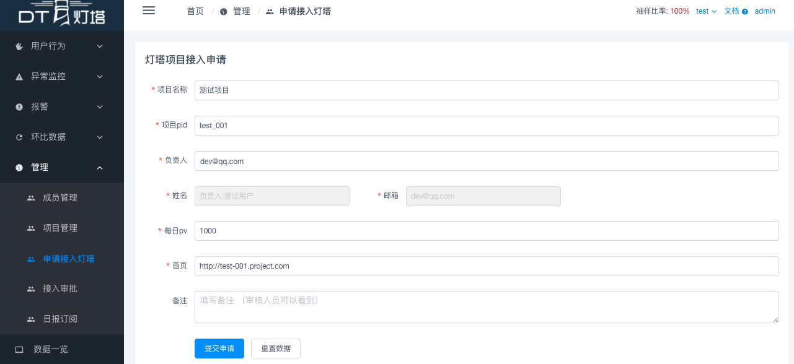
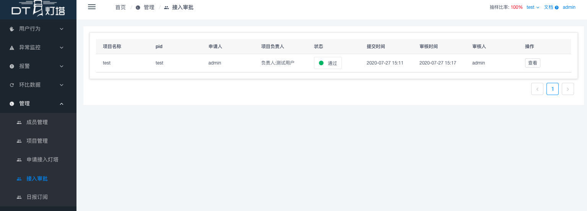

# Puppeteer安装
参见
- [国内下载安装 Puppeteer 的方法](https://brickyang.github.io/2019/01/14/%E5%9B%BD%E5%86%85%E4%B8%8B%E8%BD%BD%E5%AE%89%E8%A3%85-Puppeteer-%E7%9A%84%E6%96%B9%E6%B3%95/)

# 生成建表语句
创建platform数据库, 然后执行 `npm run fee Utils:GenerateSQL 1 '2020-06' '2020-07' > init.sql` 生成数据库SQL, 执行`mysql -u root -h 127.0.0.1  platform -p < init.sql`, 执行建表语句

# mysql表说明
用户
- `t_o_user` 用户表
- `t_o_project_member` 成员表

项目
- `t_o_project` 项目表
- `t_o_project_apply` 项目申请表

报警
- `t_r_alarm_log` 报警日志表
- `t_o_alarm_config` 报警配置表
- `t_o_alarm_es_id` 报警日志与ES日志关联表

SourceMap
- `t_o_sourcemap` sourcemap表

打点
- `t_o_dot_event_info` 打点配置表
- `t_o_dot_event_props` 打点属性表
- `t_o_dot_event_tags` 打点配置标签表

日报
- `t_r_count_daily` 性能数据日报表
- `t_o_count_diary` 错误数据日报表
- `t_o_daily_subscribe` 日报订阅表

# 权限说明（仅做了简单区分）
- 系统权限
    - `admin` 管理员，可以查看和管理所有项目
    - `dev` 普通用户
- 项目权限
    - `owner` 项目管理者，可对项目信息以及项目成员等进行管理
    - `dev` 仅可以查看有权限的项目

# 启动 `Web server`
1. `npm run watch` 启动babel监控
2. `npm run dev` 启动 `Web Server`
2.  访问 http://localhost:3000/，开发环境下，静态资源默认被代理到8080端口，因此需要在8080端口启动Client服务

# 启动 `Job server`
- 建议将数据清洗任务单独部署到一台任务机上，以保证灯塔web服务的稳定性
- 在任务机上部署代码成功后，使用 `pm2 start pm2_fee_consume.json` 指令启动数据清洗任务进程，默认以cluster模式启动六个进程同时消费。
(*该任务区别于1.0版本的数据清洗任务，去掉了日志写入磁盘的步骤，并且不再通过每分钟启动一个进程进行清洗的方式来清洗数据，而是以 `cluster` 模式启动多个常驻进程持续清洗数据*)
- 使用 `pm2 start pm2_fee_task_manager.json` 启动其他定时任务，如：监控任务、日报任务等等

# 读取Nginx日志规范，及打点规范
1. Nginx需要打点的日志格式
    ```text
    2019-04-18T16:00:00+08:00       -       -       111.160.30.22   111.160.30.22   200     0.000   3058    43      15d04347-be16-b9ab-0029-24e4b6645950    -       -       9689c3ea-5155-2df7-a719-e90d2dedeb2c 937ba755-116a-18e6-0735-312cba23b00c    GET HTTP/1.1    http://feedemo.lianjia.com/demo.gif?d=%7B%22type%22%3A%22error%22%2C%22code%22%3A7%2C%22detail%22%3A%7B%22error_no%22%3A%22%E9%A1%B5%E9%9D%A2%E6%8A%A5%E9%94%99_JS_RUNTIME_ERROR%22%2C%22url%22%3A%22demo.lianjia.com%2Findex.html%22%7D%2C%22extra%22%3A%7B%22desc%22%3A%22Uncaught%20INVALID_STATE_ERR%20%3A%20Pausing%20to%20reconnect%20websocket%20at%20http%3A%2F%2Fdemo.lianjia.com%2Fasset%2Fmodule%2Fsoftphone%2Freconnecting-websocket.js%3A1%3A2820%22%2C%22stack%22%3A%22no%20stack%22%7D%2C%22common%22%3A%7B%22pid%22%3A%22hello_fe%22%2C%22uuid%22%3A%220s2jsaq1qk2cqmr-rit6ithbu-0s2jsaq1qk2cqmr-rit6ithbu%22%2C%22ucid%22%3A99999%2C%22is_test%22%3Afalse%2C%22record%22%3A%7B%22time_on_page%22%3Atrue%2C%22performance%22%3Atrue%2C%22js_error%22%3Atrue%2C%22js_error_report_config%22%3A%7B%22ERROR_RUNTIME%22%3Atrue%2C%22ERROR_SCRIPT%22%3Atrue%2C%22ERROR_STYLE%22%3Atrue%2C%22ERROR_IMAGE%22%3Atrue%2C%22ERROR_AUDIO%22%3Atrue%2C%22ERROR_VIDEO%22%3Atrue%2C%22ERROR_CONSOLE%22%3Afalse%2C%22ERROR_TRY_CATCH%22%3Atrue%7D%7D%2C%22version%22%3A%221.0.0%22%2C%22timestamp%22%3A1555574400507%2C%22runtime_version%22%3A%221.0.0%22%2C%22sdk_version%22%3A%221.1.2%22%2C%22page_type%22%3A%22demo.lianjia.com%2Findex.html%22%7D%7D  -       Mozilla/5.0 (Windows NT 10.0; WOW64) AppleWebKit/537.36 (KHTML, like Gecko) Chrome/58.0.3029.110 Safari/537.36 SE 2.X MetaSr 1.0     -       sample=-&_UC_agent=-&lianjia_device_id=-&-      -       -       -
    ```
2. 日志对应ngnix日志格式(仅供参考,不能直接使用)
   ```text
   $time_local                      -       -       $http_x_real_ip $http_host  $status $request_time $request_length $body_bytes_sent      15d04347-be16-b9ab-0029-24e4b6645950    -       -       9689c3ea-5155-2df7-a719-e90d2dedeb2c 937ba755-116a-18e6-0735-312cba23b00c    $request  -       $http_user_agent     -       sample=-&_UC_agent=-&lianjia_device_id=-&-      -       -       -
   
   ```
3. Nginx日志存储格式
    ```text
    首先在/server/src/configs/common.js 里配置Nginx公共路径nginxLogFilePath
    此路径下的日志文件格式需为：
    nginxLogFilePath/YYYYMM/DD/HH/mm.log
    例子：/root/nginx/log/201904/18/20/28.log
    任务会每分钟读取对应路径下的日志文件，然后分析入库。

    如果可以使用kafka工具，则可以在/server/src/configs/kafka.js 里配置kafka
    然后在 /server/src/configs/common.js 里设置use.kafka为true

    自此，跑批任务Task:Manager会根据用户配置完成数据的接受，分析，存储
    ```

# 任务及其执行周期
在 `server` 目录下执行 `npm run fee` 可以查看所有可执行的任务列表
- 常驻任务
    - `npm run fee Consume:Kafka` // kafka日志消费任务
    - `npm run fee Task:Manager` // 调度任务，用于调度下述任务
- 定时任务
    - `npm run fee Clear:ClearErrorAlarmLog` // [按天]监控日志清理任务
    - `npm run fee Summary:DailyFileReport` // [按天]统计任务机器的资源使用情况，每天发送日报给管理员
    - `npm run fee Summary:DailyReportAll` // [按天]统计所有项目的日报数据发送给系统管理员
    - `npm run fee Summary:DailySubscriptionReport` // [按小时]，根据用户订阅的项目记录，发送相关项目的日报数据给用户
    - `npm run fee Summary:PerformaceUrlList` // [按小时]基于ES数据库统计每个项目的性能URL LIST
    - `npm run fee Utils:CleanOldLog` // [按天]清理任务机上的日志，只保留当前月内数据, 每月20号之后自动删除上个月数据
    - `npm run fee Utils:HeartBeat` // [按分钟]心跳检测报告本服务是否存活
- 其他任务
    - `npm run fee Utils:GenerateSQL` // 生成项目在指定日期范围内的建表SQL

#   上线CheckList
-   [ ] 线上环境是否可以正常链接kafka? (op是否已安装librdkafka)
-   [ ] log文件是否可以正常写入?
-   [ ] 是否有不必要的log? 是否有可能会引起磁盘打满的log?(一条日志一个log, 会导致磁盘直接打满)
-   [ ] kafka autoCommit默认是打开的，是否关闭，自己控制什么时候提交。

#   API编写CheckList
-   [ ] list接口无数据时是否返回空列表(而不是空对象)
-   [ ] 必要的增删改查(add/udate/detail/list/delete)是否齐备
-   [ ] 添加修改接口是否进行了权限校验

#   数据库建表CheckList
1.  在极端情况下, 数据库单表容量是否绝不会超过一千万条数据
2.  是否有以下字段
    1.  create_time, 记录创建时间, bigint
    2.  update_time, 记录更新时间, bigint
    3.  create_ucid, 记录创建人ucid, varchar(20) , 可选, 只有当会有人编辑记录时才需要该字段
    4.  update_ucid, 记录更新人ucid, varchar(20) , 可选, 只有当会有人编辑记录时才需要该字段

#   系统接入流程
1. 后台填写相关项目信息



2. 接入审批【admin权限可以查看该页面】,审批通过后就可以查看该项目了

